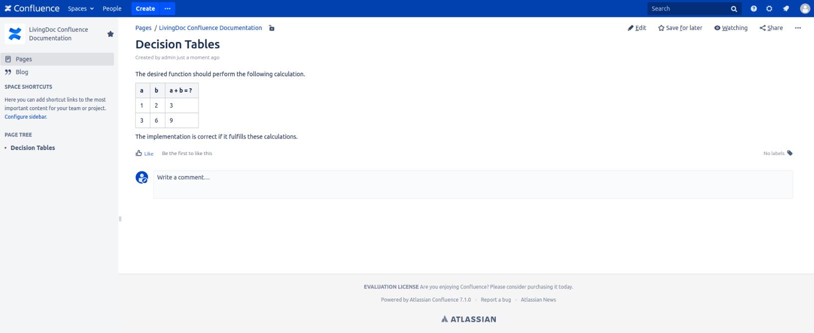
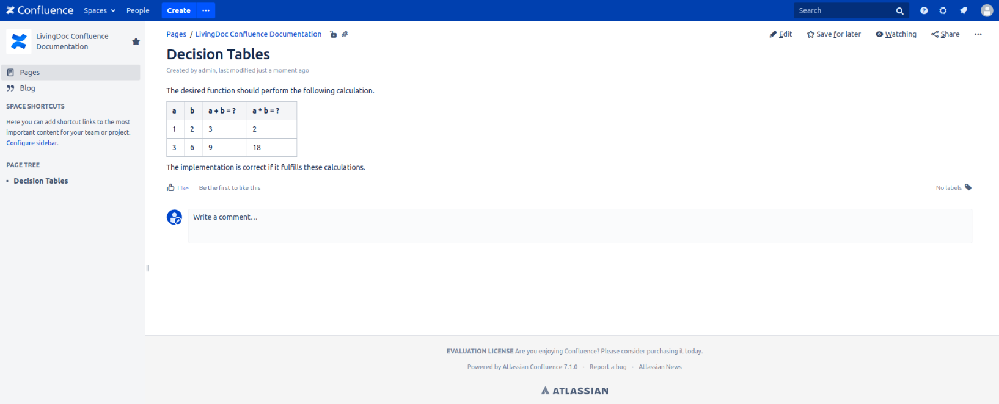
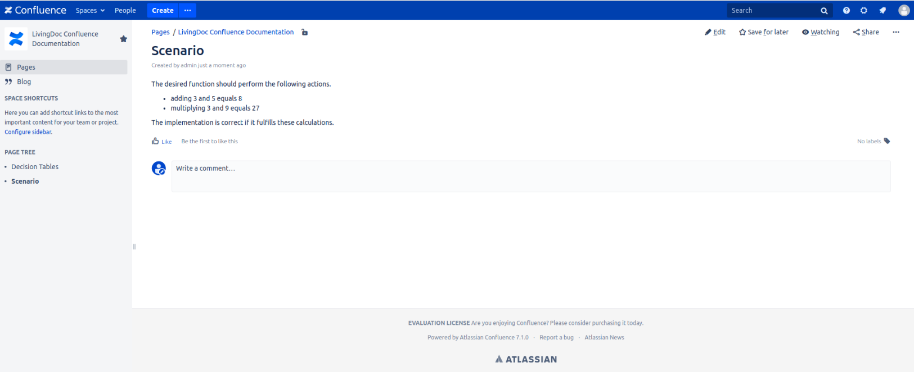

== Storing Test Data
Writing tests in Markdown, HTML and Confluence is easy with the help of the individual tables and list elements, or in the case of confluence an editor.
The following section shows you some examples of how to create your own.

=== Formats
Test data can be written in different files and formats.
This section describes them in short and gives sources for further reading.

==== HTML
https://www.w3schools.com/html/[HTML] is a markup language to structure a document.
The file ending is `.html`.
In the web development it is used to create a basic skeleton for a page which is later be filled with more functionalities and style.

Basically you use tags to define an area.
Based on the tag you can write content like text or even more tags to structure it even further.
For LivingDoc, mostly the tags for creating tables and lists to define areas for decision tables and scenarios.
LivinDoc can also handle a custom tag for Gherkin.

==== Markdown
https://www.markdownguide.org/[Markdown] is a lightweight markup language to format an structure a document.
The file ending is `.md`.

It is mostly used to create simple and clean structured pages.
In contrast to HTML, it offers less functionalities and possibilities to style but is easier to read and use.
https://www.markdownguide.org/[Markdown] does not use any tags and enables a much more fluent style of writing and reading.

=== Storage
Files can be created and accessed in a few ways.
The supported methods for accessing and editing data are presented in this section.

==== Confluence
Working with Confluence is easy.
It offers many tools for editing and creating pages.
For more detailed documentation on how to use the editor in Confluence, check out the link:https://confluence.atlassian.com/doc/the-editor-251006017.html[official site].

===== Decision Table
A simple confluence page for a decision table could look like this.
You can insert your tables anywhere on the page by placing text and descriptions before or after them.

.Example of decision tables in Confluence

You can add more calculations by adding more columns.
This way you do not have to create multiple tables for the same input values but different calculations/actions.

.Example of a wider decision table in Confluence

===== Scenario
To use the scenario, you must add an bullet list.
Each entry in this list represents a scenario.
If you use the format described above, an example might look like the following.

.Example of a scenario in Confluence

As in decision tables, you can add text before and after the list.
So you can place it anywhere within the page.

==== File repository
A file repository is a local collection of files.
They can be accessed through their path and names.
In this case all the necessary test data is stored in HTML or Markdown files somewhere on the local file system.

Another possibility to access the data is using REST.
With REST you can access the data of a local file system from remote using HTTP protocolls and mechanics.

==== Git repository
A Git repository can be a local file repository but is mostly used to store files on a remote system.
This way users can share their files.
Besides sharing files and update them, Git makes it possible to have a versioning system and the possibility to trace back changes.
You can also use Git to use it at some sort of backup if your local machine fails.
