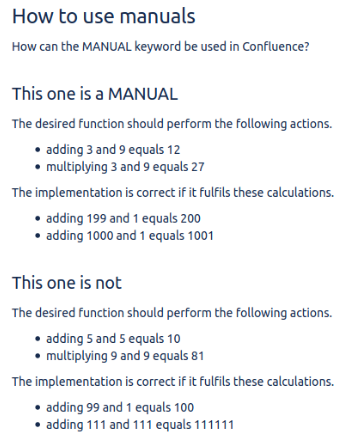
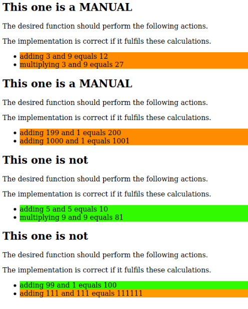

== Test reports
Test report can be configured to be generated after each test run.
They are exported as a HTML file and allow to see which tests did run successful and which did not fast.

In Confluence the test reports are uploaded as attachments to the corresponding page.
They are uploaded and automatically updated when configured to do so.

=== Overview
A test report reflects the actual page.
Whether it is written in HTML, Markdown or Confluence, the export is usually an HTML file.

The tested page is displayed as a simple HTML page.
The result of an execution is displayed in color.
In a table the single cells are colored and in a scenario the whole line.

This allows the user to quickly see the individual executions and identify faulty executions.

=== Meaning of colors
Like described earlier a Confluence page with test data could look like the following.

.Corresponding Confluence page for the report

Similar test data is used in a section called `This one is a MANUAL` and `This one is not`.
Hence the test data for the first section is ignored.
This is highlighted by the color orange.
Only tests for the second are executed.
This is why they are colored green.

Furthermore the last test data is corrupted.
So the test will fail.
In this case the corresponding line will also highlighted with orange.

.Example of how a test report can look like

