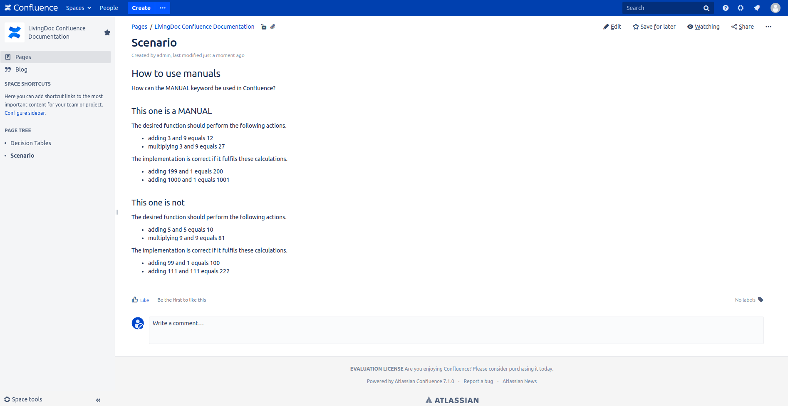

== Writing Test Data
In LivingDoc, it is possible to prepare test data (also known as examples) in different ways.
The following section will explain how the two possibilities for writing test data are used.

=== LivingDoc Syntax

==== Decision Tables
> Decision Table: A table where each row represents a test case.
A column can contain either a test input or an expectation.

Decision tables are a simple table containing input values and multiple possible functions for each column.
Each row therby represents a test case where the given input values are calculated using the functions and checked with the corresponding result.
Decision tables are easily created by writing them as a markdown table, a HTML table or using confluence.

Table 1 is an example of a valid table that you can recreate using any of the ways mentioned before.

.Example Decision Table

|===
|value a |value b |a + b = ?

|1
|2
|3

|-1
|2
|1
|===

In this example the columns `value a` and `value b` are test inputs and the column
`a + b = ?` contains the expected result.
When a test case is executed, each row is considered as a seperate test.
So in the end it will check if `1 + 2 = 3`.
If the result of the test written behind does match the value of the result cell, the implementation is correct in terms of fulfilling the tests requirements.

==== Scenario
> Scenario: An example describing a single test case as a sequence of steps.
Each step is represented as a sentence containing either one or more test inputs
and any number of expectations.

Scenario are written in plain text.
In this case every line can be used for a test case or a test step.
By writing a meaningful scenario the data inside each sentence can be used and executed.
Scenario  don't need any tables.
The input values and the result are contained inside a sentence or message.

It has to be possible to extract any necessary information out of the message in order to create a test case.
Hence it should be self-contained.

.Example Scenario - Structure
    adding {a} and {b} equals {c}

In this example, the purpose of the decision table above is converted into a sentence.
The input values `a` and `b` exist as well as the result `c`.
When writing a scenario it has to be clear what an input values and what the result is.

With this knowledge we can go ahead and write a simple scenario.

.Example Scenario - Final
    adding 1 and 2 equals 3

In this example the values for `a` and `b` are replaced with string values as well as the expectation `c`.
The test script that is prepared by a test engineer should be able to use `a = 1` and `b = 2` and check if it matches `c = 3`.
If the result of this test does match the value of the expectation, the implementation is considered as correct.

A list that wants to represent a scenario must contain at least two elements.
Otherwise it is not recognized as one and won't be executed.

==== Annotation for manual Tests
It is possible to exclude a table or scenario from execution.
You can use `MANUAL` to mark them.
By declaring a section in a page as `MANUAL` the whole selection will be  ignored when tests are run.
This way, the user can work on decision tables and scenarios without the risk of breaking existing tests.

A `MANUAL` section is created by writing `MANUAL` in any place of the header.
The `MANUAL` is valid until the next section or header is declared.
It is not necessary to declare a section with the same hierarchy.
For example a h2 in HTML will be a new section when declared after a h1 which is manual.

.Example Declaring a MANUAL section in Markdown
    # Section (it is a MANUAL)
    - adding 1 and 2 equals 3

    # MANUAL Section XY
    - adding 3 and 6 equals 9

.Example Declaring a MANUAL section in HTML
    <h1>MANUAL Test</h1>
    <table>
        ...
    </table>

.Example Declaring a MANUAL section in Confluence

So in the example above the MANUAL tag is used in a header on level 2.
Everything up to the next level 2 header line is ignored during execution to avoid using unfinished scenarios or tables for testing.

==== Expected Exceptions
You can use a string named after an exception as any expected result of a decision table or scenario.
The exception can be used to check for unwanted behavior.
For example, you can add corrupt input values to check whether a function behaves as you would expect.
A test is only successful if the exception thrown from the underlying code matches the exception you specify as the result.
If no exception is thrown, but you expect one, the test will fail.

=== Gherkin
LivingDoc supports link:https://cucumber.io/docs/gherkin/[Gherkin].
Gherkin is a more structured language to describe test data by using some defined keywords and rules.
Have a look at the official documentation of link:https://cucumber.io/docs/gherkin/[Gherkin] to find out more.

For now LivingDoc only supports Gherkin in plain HTML.
The `<gherkin>` tag is nested inside a `<pre>` tag of the HTML file.
